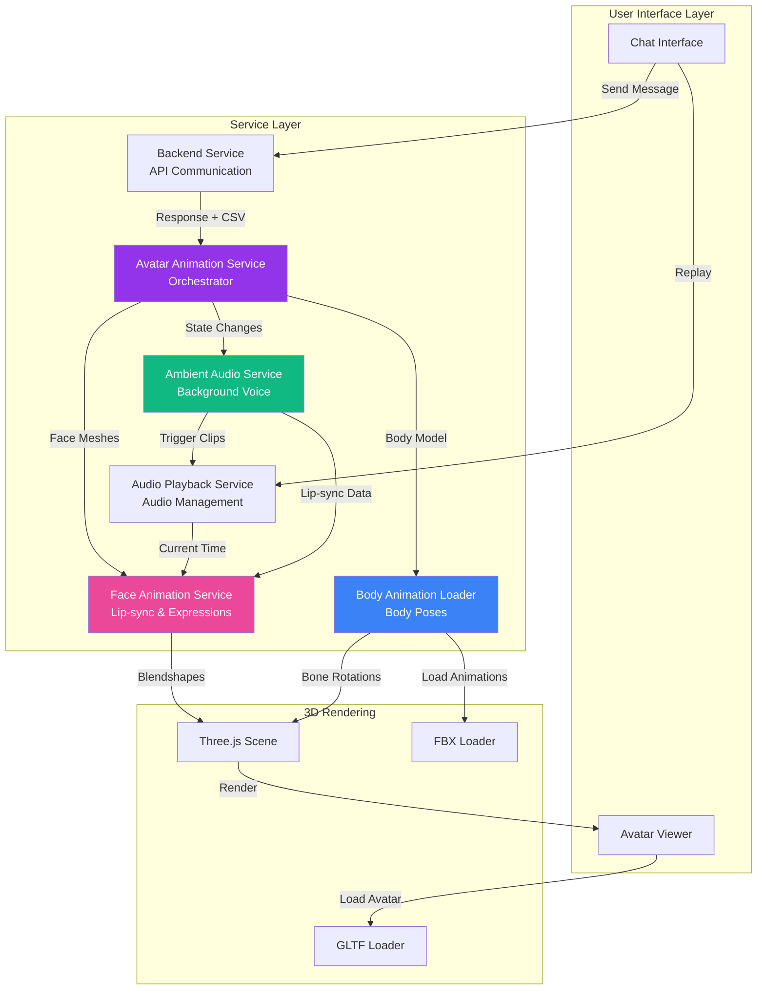
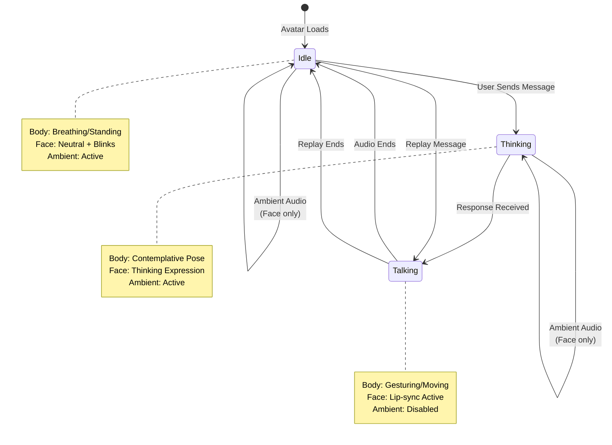
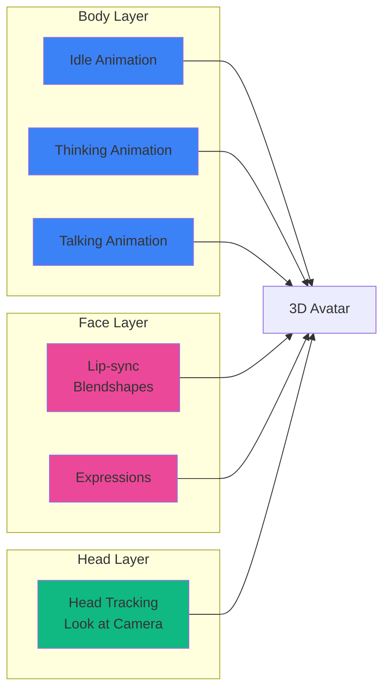
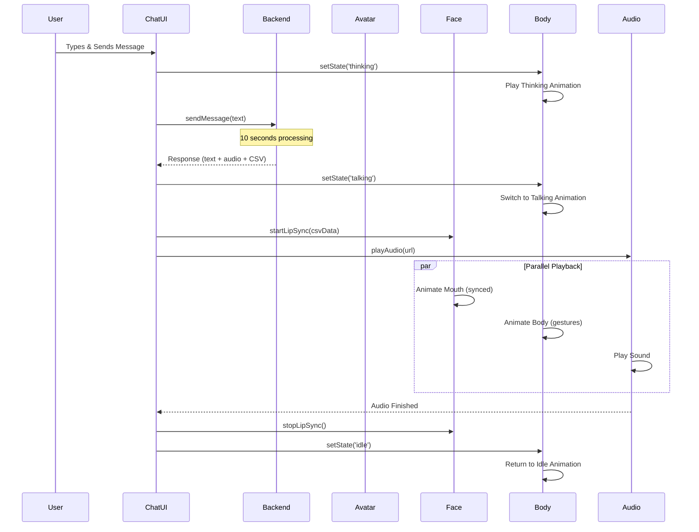
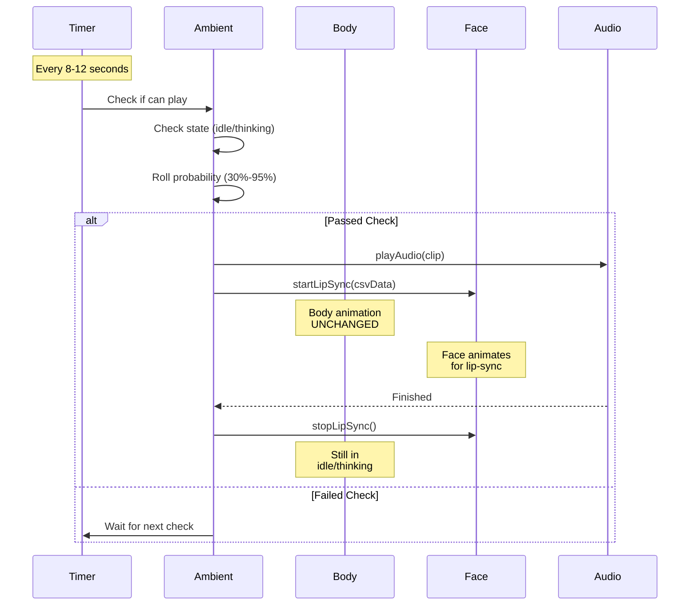

# AI Avatar Chat System

An interactive 3D avatar chat application with real-time lip-sync, body animations, and ambient behaviors built with Angular and Three.js.

---

## Table of Contents

- [Features](#features)
- [Architecture Overview](#architecture-overview)
- [Service Layer](#service-layer)
- [Animation System](#animation-system)
- [Flow Diagrams](#flow-diagrams)
- [Project Structure](#project-structure)
- [Setup](#setup)

---

## Features

### 1. Avatar System
- **3D Avatar Rendering** - Ready Player Me avatars with full rigging
- **Facial Animation** - 52 ARKit blendshapes for realistic expressions
- **Body Animation** - Idle, thinking, and talking poses with smooth transitions
- **Head Tracking** - Avatar looks at camera with natural eye contact
- **Ambient Behaviors** - Random idle animations and voice clips

### 2. Chat Interface
- **Multi-conversation** - Switch between different chat sessions
- **Image Upload** - Send images with messages
- **Audio Playback** - Listen to avatar responses with lip-sync
- **Replay Messages** - Re-listen to any message
- **Real-time Status** - Visual indicators for thinking/talking states

---

## Architecture Overview



---

## Service Layer

### 1. Avatar Animation Service (Orchestrator)
**Role:** Central coordinator for all avatar animations

```typescript
class AvatarAnimationService {
  // Manages body state (idle/thinking/talking)
  setAvatarState(state: 'idle' | 'thinking' | 'talking')
  
  // Face animation (lip-sync)
  startLipSync(csvData: any[])
  stopLipSync()
  
  // Distributes data to specialized services
  setAvatarData(meshes, model, animations)
}
```

**Coordinates:**
- Face animations (through FaceAnimationService)
- Body animations (through BodyAnimationLoaderService)
- State transitions (idle ↔ thinking ↔ talking)

---

### 2. Face Animation Service
**Role:** Controls facial expressions and lip-sync

```typescript
class FaceAnimationService {
  // Morph target meshes (face)
  setMorphTargetMeshes(meshes: any[])
  
  // Lip-sync with audio
  startLipSync(csvData: any[])
  stopLipSync()
  
  // Manual expressions
  applyFaceBlendshapes(params: any)
}
```

**Features:**
- **Independent from body** - Face can animate while body is idle/thinking
- **Audio-synced** - Reads audio playback time for perfect sync
- **52 Blendshapes** - Full ARKit facial animation support

---

### 3. Body Animation Loader Service
**Role:** Manages body poses and animations

```typescript
class BodyAnimationLoaderService {
  // Load and setup
  setAvatarModel(model: Object3D, animations: AnimationClip[])
  
  // Play animations
  playRandomAnimation(state: 'idle' | 'thinking' | 'talking')
  
  // Animation system
  update() // Called every frame
}
```

**Animation States:**
- **Idle** - Breathing, standing, looking around
- **Thinking** - Contemplative poses
- **Talking** - Hand gestures, body movement

---

### 4. Audio Playback Service
**Role:** Handles all audio playback

```typescript
class AudioPlaybackService {
  playAudio(url: string): Promise<void>
  stop()
  getCurrentTime(): number // For lip-sync
  isPlaying(): boolean
}
```

**Features:**
- Promise-based playback
- Real-time position tracking
- State management

---

### 5. Ambient Audio Service
**Role:** Plays background voice clips during idle/thinking

```typescript
class AmbientAudioService {
  // Automatic playback every 8-12 seconds
  // Plays FACE animation WITHOUT changing body state
  
  setEnabled(enabled: boolean)
  playSpecificClip(audioPath, csvPath)
}
```

**Behavior:**
- Monitors body state (idle/thinking)
- Random probability checks (30%, 70%, 95%)
- Face lip-sync only - body keeps current animation

---

### 6. Backend Service
**Role:** API communication and data processing

```typescript
class BackendService {
  sendMessage(text: string, images?: string[]): Promise<Response>
  parseCSV(csvData: string): any[]
}
```

---

## Animation System

### 1. State Flow



### 2. Animation Layers



**Key Concept:** Each layer operates independently and combines in real-time!

---

## Message Flow

### 1. New Message Flow



### 2. Ambient Audio Flow



---

## Project Structure

```
src/app/
├── services/                    # Business Logic Layer
│   ├── avatar-animation.service.ts      # Orchestrator
│   ├── face-animation.service.ts        # Face/Lip-sync
│   ├── body-animation-loader.service.ts # Body Animations
│   ├── audio-playback.service.ts        # Audio Control
│   ├── ambient-audio.service.ts         # Background Voice
│   └── backend.service.ts               # API Communication
│
├── avatar-viewer/               # 3D Rendering Component
│   ├── avatar-viewer.ts         # Three.js scene setup
│   ├── avatar-viewer.html       # Canvas + controls
│   └── avatar-viewer.css        # Styling
│
└── chat-interface/              # Chat UI Component
    ├── chat-interface.ts        # Message handling
    ├── chat-interface.html      # Sidebar + messages
    └── chat-interface.css       # Chat styling

public/assets/
├── ambient-audio/               # Ambient voice clips
│   ├── idle/                    # Idle state clips
│   │   ├── hello.wav + .csv
│   │   ├── still_waiting.wav + .csv
│   │   └── here_to_help.wav + .csv
│   └── thinking/                # Thinking state clips
│       └── let_me_think.wav + .csv
│
├── body-animations/             # FBX animations
│   ├── idle/                    # Idle poses
│   ├── thinking/                # Thinking poses
│   └── talking/                 # Talking gestures
│
├── default-avatar.glb           # 3D avatar model
├── environment.hdr              # HDR lighting
├── animation_frames.csv         # Response lip-sync data
└── out.wav                      # Response audio
```

---

## Setup

### 1. Prerequisites
```bash
Node.js >= 18
Angular CLI >= 18
```

### 2. Installation
```bash
# Install dependencies
npm install

# Start development server
ng serve

# Open browser
http://localhost:4200
```

### 3. Adding Assets

**Avatar Model:**
1. Export from Ready Player Me with ARKit morphTargets
2. Save as `default-avatar.glb` in `public/assets/`

**Body Animations:**
1. Export from Mixamo as FBX
2. Place in appropriate state folder:
   - `public/assets/body-animations/idle/`
   - `public/assets/body-animations/thinking/`
   - `public/assets/body-animations/talking/`

**Ambient Audio:**
1. Create audio file (WAV format)
2. Generate CSV with blendshape data (same format as response)
3. Place both in:
   - `public/assets/ambient-audio/idle/` or
   - `public/assets/ambient-audio/thinking/`

---

## Performance

- **FPS Target:** 60 FPS
- **Animation Update:** Every frame
- **State Checks:** Every 8-12 seconds (ambient)
- **CSV Parsing:** Once per response
- **Audio Sync:** 30 FPS tolerance (0.033s)

---

## Customization

### 1. Adding New Body Animations
1. Export FBX from Mixamo
2. Place in appropriate state folder
3. Service auto-loads and categorizes by folder name

### 2. Adding New Ambient Clips
1. Record voice line
2. Generate CSV blendshapes
3. Add to `ambientClips` array in `ambient-audio.service.ts`:
```typescript
{
  audioPath: '/assets/ambient-audio/idle/new_clip.wav',
  csvPath: '/assets/ambient-audio/idle/new_clip.csv',
  forState: 'idle',
  chance: 0.5
}
```

### 3. Changing Probabilities
Edit chances in `ambient-audio.service.ts`:
```typescript
chance: 0.3  // 30% chance
chance: 0.7  // 70% chance
chance: 0.95 // 95% chance
```

---

## License

MIT

---

## Contributing

Pull requests welcome! Please follow existing code style and add appropriate console logging.